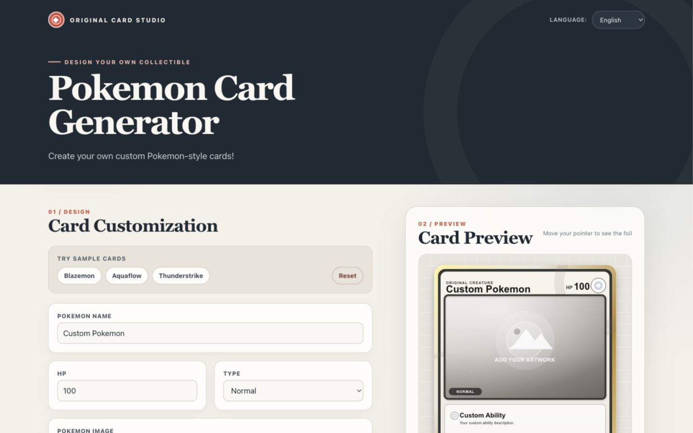
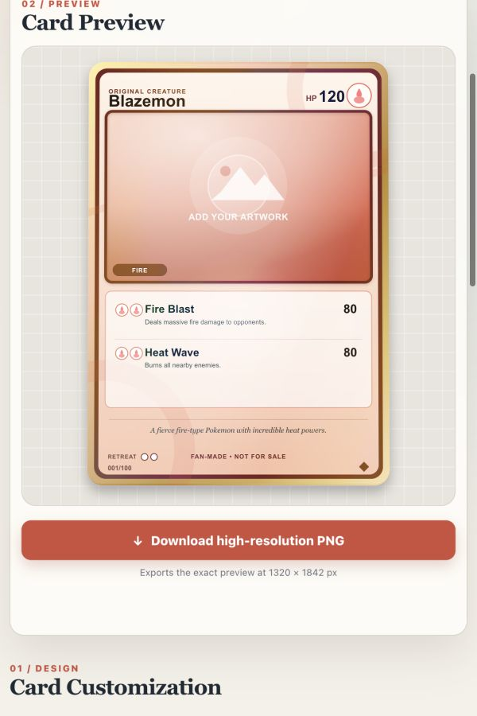
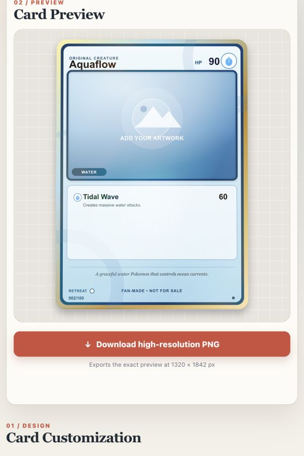
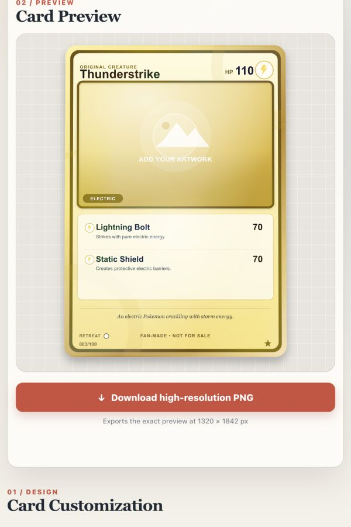

<div align="center">

# Original Card Studio

### オリジナルのコレクションカードを、ブラウザでデザイン。

名前・属性・技・画像を組み合わせて、オリジナルカードをリアルタイムに作成できるWebアプリです。<br>
完成したカードは、画面で見たままのデザインを高解像度PNGとして保存できます。

[](https://react.dev/)
[](https://vite.dev/)
[](https://nodejs.org/)
[](./LICENSE)

</div>



## Live Demo

[Original Card Studioを開く](https://yuhara-4113-ai.github.io/original-poke-card-generator/)

## Features

| | 機能 | 内容 |
|:--:|---|---|
| ✦ | **リアルタイムプレビュー** | 入力内容を即座にカードへ反映します |
| ◈ | **18種類の属性テーマ** | 属性ごとに配色・アイコン・雰囲気が変化します |
| ✧ | **インタラクティブな光沢** | ポインターの位置に合わせてカードの光沢が動きます |
| ↑ | **画像アップロード** | JPG・PNG・WebPをブラウザ内で安全に扱います |
| ↓ | **高解像度PNG出力** | プレビューと同じ内容を1320 × 1842 pxで保存します |
| 文 | **日本語・英語対応** | UIをいつでも切り替えられます |
| ◐ | **レスポンシブ対応** | デスクトップからモバイルまで快適に操作できます |

## Sample Cards

<table>
  <tr>
    <th>Blazemon</th>
    <th>Aquaflow</th>
    <th>Thunderstrike</th>
  </tr>
  <tr>
    <td></td>
    <td></td>
    <td></td>
  </tr>
  <tr>
    <td align="center">Fire</td>
    <td align="center">Water</td>
    <td align="center">Electric</td>
  </tr>
</table>

## Quick Start

### Requirements

- Node.js `20.19+` または `22.12+`
- npm

### Setup

```bash
git clone https://github.com/yuhara-4113-ai/original-poke-card-generator.git
cd original-poke-card-generator
npm install
npm run dev
```

起動後、ブラウザで [http://localhost:5173](http://localhost:5173) を開いてください。

## How to Use

1. サンプルカードを選ぶか、名前・HP・属性を入力します。
2. オリジナル画像、技、ダメージ、説明文を設定します。
3. 右側のプレビューで仕上がりを確認します。
4. **高解像度PNGをダウンロード**から画像を保存します。

アップロードした画像はサーバーへ送信されず、ブラウザ内だけで処理されます。

## Design & Architecture

### まず全体像

このアプリは、**ブラウザだけで完結するReact製のシングルページアプリケーション（SPA）**です。バックエンド、データベース、外部APIはありません。入力したカード情報やアップロード画像はReactのstateとしてブラウザのメモリ上に保持され、カードのSVGへ即座に反映されます。

中心にあるのは `PokemonCardGenerator` です。このコンポーネントがカード情報をまとめて持ち、左側の入力フォーム、右側のプレビュー、PNG保存をつないでいます。

```text
LanguageProvider（表示言語と翻訳）
└── App
    └── PokemonCardGenerator（カード情報を一元管理）
        ├── CardForm（入力を受け取る）
        ├── PokemonCard（プレビューと光沢・傾き）
        │   └── CardArtwork（カード本体のSVG）
        └── DownloadButton（同じSVGをCanvas経由でPNGに変換）
```

データの流れは一方向です。

```text
ユーザー入力
    ↓ コールバック
PokemonCardGenerator の state を更新
    ↓ props
CardArtwork が SVG を再描画
    ↓ ref で同じ SVG を取得
DownloadButton が 2倍サイズの PNG に変換
```

フォームとプレビューがそれぞれ別のカード情報を持つのではなく、親にある1つのstateを共有していることが重要です。これにより、入力値とプレビューの食い違いを防いでいます。

### 主要コンポーネントの役割

| ファイル | 役割 |
|---|---|
| `src/main.jsx` | ReactアプリをHTMLの `#root` にマウントする起点 |
| `src/App.jsx` | ページ全体の骨組み。言語Provider、ヘッダー、メイン、フッターを配置 |
| `src/components/PokemonCardGenerator.jsx` | アプリの中核。カード情報、画像、レイアウトのstateと更新処理を管理 |
| `src/components/CardForm.jsx` | 入力欄を表示。値そのものは保持せず、変更を親へ通知 |
| `src/components/PokemonCard.jsx` | SVGを包み、ポインター位置に応じた傾き・光沢を制御。保存処理へSVGのrefも公開 |
| `src/components/CardArtwork.jsx` | カードをSVGで描画。通常版と全面アート版のレイアウトを担当 |
| `src/components/cardTheme.js` | 18属性の色と属性アイコンの対応表 |
| `src/components/DownloadButton.jsx` | SVG内の画像を埋め込み、Canvasへ描画して1320 × 1842 pxのPNGを保存 |
| `src/contexts/LanguageContext.jsx` | 日本語・英語の選択、翻訳関数、選択言語のlocalStorage保存 |
| `src/contexts/translations.js` | UI文言、初期値、サンプルカードの日英辞書 |
| `src/styles/pokemon-cards.css` | ポインターに追従する傾き・光沢エフェクト |
| `public/type-icons/` | SVGカード内で使う18属性のアイコン |

### 中心となるデータ

`PokemonCardGenerator` が持つ `cardData` は、概ね次の形です。

```js
{
  name: 'カード名',
  hp: '100',
  type: 'fire',
  image: null,
  abilities: [
    { name: '技名', description: '説明', energyCost: 1, damage: '50' }
  ],
  description: 'カードの説明',
  weakness: 'water',
  resistance: 'none',
  retreatCost: 1,
  cardNumber: '001/100',
  rarity: 'common'
}
```

このほか、画像の位置・倍率を持つ `imageAdjustment`、通常版か全面アート版かを表す `layoutMode` があります。新しい入力項目を追加するときは、基本的に「初期state → `CardForm` の入力欄 → `CardArtwork` の描画」の3か所をつなぎます。

### 重要な処理

#### 1. 画像アップロード

画像は `FileReader` でData URLへ変換し、サーバーへ送らずブラウザ内で使用します。ファイル種別を画像に限定し、サイズは8MBまでです。読み込んだ画像の元サイズを保存し、SVGの画像枠を隙間なく覆うように拡大・切り抜きして、位置とズームを調整します。

#### 2. カード描画

カード本体はHTMLの寄せ集めではなく、固定座標系 `660 × 921` の1枚のSVGです。通常版と全面アート版は同じ `CardArtwork.jsx` 内で切り替わります。長い名前は文字サイズを縮め、説明文は日本語・英語の文字幅を大まかに考慮して折り返します。

#### 3. 光沢と立体表現

`PokemonCard.jsx` がカード上のポインター位置を百分率で計算し、CSSカスタムプロパティへ渡します。CSSはその値を使ってカードを傾け、光沢と反射位置を動かします。これは表示上の演出で、カード情報そのものには影響しません。

#### 4. PNG保存

プレビュー中のSVGを複製し、外部参照している属性アイコンをData URLとして埋め込んでからCanvasへ描画します。Canvasを2倍の `1320 × 1842` にすることで高解像度PNGを生成します。光沢を含める場合は、最後にCanvas上へ光沢を合成します。

プレビューと保存で同じSVGを使うため、別々のレイアウト実装を同期する必要がなく、文字や画像の位置がずれにくい設計です。

#### 5. 多言語対応

`LanguageProvider` が現在の言語と `t('キー名')` 形式の翻訳関数を全コンポーネントへ提供します。選択言語だけはlocalStorageに保存されるため、再訪時も維持されます。一方、編集中のカード情報は保存されないので、ページを再読み込みすると初期状態へ戻ります。

### ディレクトリ構成

```text
.
├── public/type-icons/       # 属性アイコン（静的ファイル）
├── src/
│   ├── components/          # フォーム、カード描画、保存などの主要機能
│   ├── contexts/            # 言語stateと翻訳辞書
│   ├── styles/              # カード固有のエフェクト
│   ├── App.jsx              # ページ構成
│   └── main.jsx             # Reactの起動地点
├── docs/assets/             # README用画像
├── .github/workflows/       # GitHub Pagesへの自動デプロイ
├── vite.config.js           # Vite設定と公開先のベースパス
└── package.json             # 依存パッケージとnpm scripts
```

### 変更するときの入口

| やりたいこと | 最初に見る場所 |
|---|---|
| 入力項目を増やす | `PokemonCardGenerator.jsx`、`CardForm.jsx`、`CardArtwork.jsx` |
| カードの見た目や配置を変える | `CardArtwork.jsx` |
| 属性の色やアイコンを変える | `cardTheme.js`、`public/type-icons/` |
| 光沢や傾きを変える | `PokemonCard.jsx`、`src/styles/pokemon-cards.css` |
| PNGのサイズや生成方法を変える | `DownloadButton.jsx` |
| 表示文言や翻訳を変える | `src/contexts/translations.js` |
| ページ全体のレイアウトを変える | `App.jsx`、`App.css`、`PokemonCardGenerator.css` |

### 現在の設計上の注意点

- バックエンドがないため、ログイン、クラウド保存、他ユーザーとの共有機能はありません。
- カード情報は永続化されません。必要ならlocalStorageやバックエンド保存を追加する必要があります。
- SVGの配置は固定座標で記述されています。見た目を変更するときは、関連する座標をまとめて確認してください。
- `vite.config.js` の `base` は現在のGitHub Pagesリポジトリ名に合わせています。公開先のリポジトリ名を変える場合はここも変更します。
- 自動テストはまだなく、品質確認はESLintとproduction buildが中心です。描画変更後は日本語・英語、通常版・全面アート版、PNG保存をブラウザで確認する必要があります。

### Tech Stack

| Category | Technology |
|---|---|
| UI | React 19 |
| Build | Vite 8 |
| Card rendering | SVG / Canvas API |
| Styling | CSS |
| Internationalization | React Context |

## Scripts

```bash
npm run dev      # 開発サーバー
npm run build    # 本番ビルド
npm run preview  # ビルド結果の確認
npm run lint     # ESLint
```

## Deployment

このサイトはGitHub Pagesで公開しています。`main`ブランチへのpush（Pull Requestのマージを含む）が行われると、GitHub Actionsがlintとproduction buildを実行し、成功した場合だけ自動的にデプロイします。

`codex/**`ブランチへのpushでは、`main`の内容を本番URLに維持したまま、対象ブランチを次の検証URLへデプロイします。

- 本番: [https://yuhara-4113-ai.github.io/original-poke-card-generator/](https://yuhara-4113-ai.github.io/original-poke-card-generator/)
- 検証: [https://yuhara-4113-ai.github.io/original-poke-card-generator/staging/](https://yuhara-4113-ai.github.io/original-poke-card-generator/staging/)

検証環境は1つです。複数の`codex/**`ブランチをpushした場合、最後に完了したデプロイ内容で上書きされます。`main`へマージすると本番ワークフローが本番だけを再デプロイし、検証URLは削除されます。

初回のみ、リポジトリの **Settings → Pages → Build and deployment → Source** で **GitHub Actions** を選択してください。Actionsタブからワークフローを手動実行することもできます。

## License & Disclaimer

インタラクティブな光沢表現は [@simeydotme/pokemon-cards-css](https://github.com/simeydotme/pokemon-cards-css) を参考にしており、本プロジェクトは [GPL-3.0](./LICENSE) のもとで公開されています。

本プロジェクトは非公式のファンメイドツールです。株式会社ポケモンおよび関連各社とは関係なく、承認・提携を受けたものではありません。
